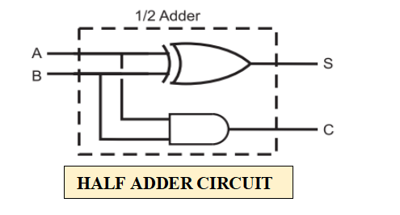
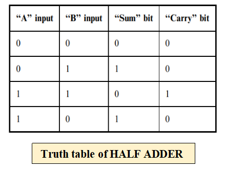
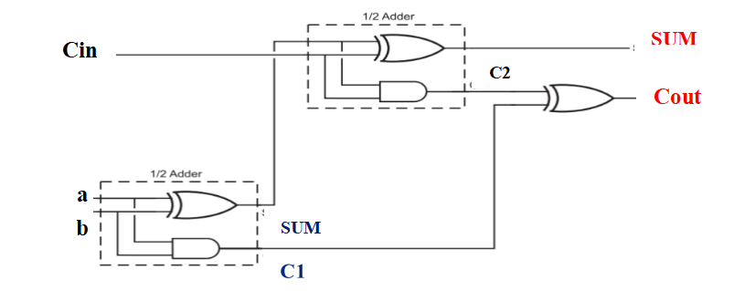
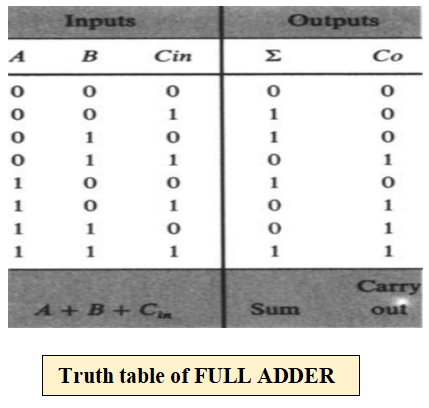
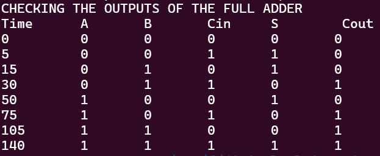
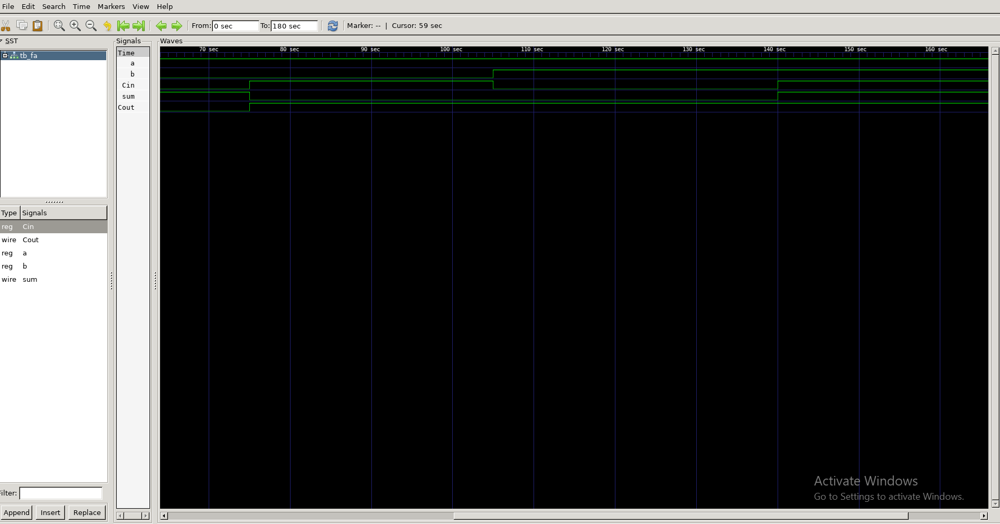
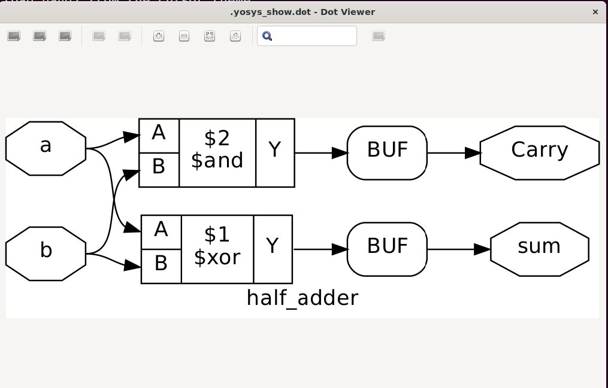
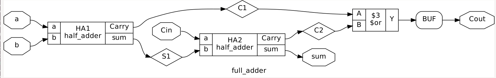
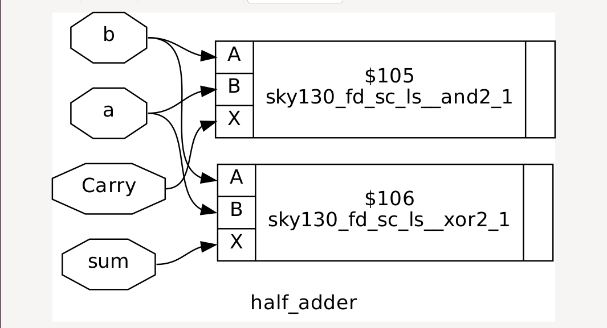
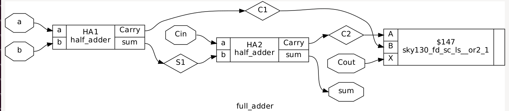

# STRUCTURAL / GATE LEVEL MODELLING OF FULL ADDER USING HALF ADDER  

##  _Contents:-_  
- [BASIC CONCEPTS](##1.-BASIC-CONCEPTS)
  - [HALF ADDER](###1.a-HALF-ADDER:-)
    - [CIRCUIT DIAGRAM](####1.a.1-CIRCUIT-DIAGRAM:-)
    - [TRUTH TABLE](####1.a.2-TRUTH-TABLE:-)
  - [FULL ADDER](###1.b-FULL-ADDER:-)
    - [CIRCUIT DIAGRAM](####1.b.1-CIRCUIT-DIAGRAM:-)
    - [TRUTH TABLE](####1.a.2-TRUTH-TABLE:-)
- [TOOLS](##2-TOOLS)
- [SIMULATION](##3.-SIMULATION:-)  
- [BEHAVIORAL TO RTL LEVEL SYNTHESIS](##4.-BEHAVIORAL-TO-RTL-LEVEL-SYNTHESIS )
- [Logic Gate Level to Physical Gate Level Synthesis](##5-Logic-Gate-Level-to-Physical-Gate-Level-Synthesis)
- [SYNTHESIS BY USING SCRIPT FILE (OPTIONAL):-](##6.-SYNTHESIS-BY-USING-SCRIPT-FILE-(OPTIONAL):-)
- [PHYSICAL GATE LEVEL SYNTHESIS](##7.-PHYSICAL-GATE-LEVEL-SYNTHESIS:-)
- [REFERENCES](##8.-REFERENCES:-)


---
##1. BASIC CONCEPTS  
---
###1.a HALF ADDER:-  
  - A combinational circuit that performs addition of two bits is known as _**Half Adder**_.

  - The input variables designated to _**Augend**_ and _**Addend bits**_.  

  - The output variables designated to _**Sum**_ and _**Carry**_.  

####**1.a.1 `CIRCUIT DIAGRAM:-`** 
  

####**1.a.2 `TRUTH TABLE:-`**  


###**1.b FULL ADDER:-**  
- A combinational circuit that performs addition of three bits is known as _**Full Adder**_.  
- The input variables designated to _**Augend**_,_**Addend**_ and _**carry**_ from the lower significant position bits.  
- The output variables designated to _**Sum**_ and _**Carry**_.  
####**1.b.1 `CIRCUIT DIAGRAM:-`**   
  

####**1.b.2 `TRUTH TABLE:-`**   
  

---
##2. TOOLS:- 
---  
| Name of tool      |       Working           |    
|-----------|--------------------------| 
| *GEANY*   |  open source IDE         |
| *Icarus Verilog*     |    Veriog code simulation & Parsing      |  
|*GTKwave*    |  Waveform viewing tool      |  
|*Yosys*      | Synthesis tool   |  
|*Skywater 130nm PDK*      | Technology library has used in this project |  
---
##3. SIMULATION:-  
---  
###`PROCEDURE:-`  
- Here *fa_by_ha.v* is _**source code**_. 
-  _**CHECK IT**_ -> [fa_by_ha.v](fa_by_ha.v).
- And *tb_fa.v* is _**testbench code**_. 
- _**CHECK IT**_ -> [tb_fa.v](tb_fa.v) 
- Use **iverilog** to check and simulate the verilog code.  
 ```
 iverilog fa_by_ha.v tb_fa.v -o test_fa 
 
 ```    
- Here [test_fa.v](test_fa.v) is the **object dump file**.Though it’s optional. 
- By default a file will create automatically after linting by iverilog named as **a.out**. 
- After successful simulation,the object dump file ([test_fa.v](test_fa.v)) has been created. 
###`OUTPUT / RESULT :-`  
- Executing the abovementioned object dump file by using this command line below-  
```  
./test_fa  
```  
- After the succesfull execution of the program, we can see the output as follows -  
  
- Hence, the **logical modelling** of the full adder using half  adder has been successfully done.  

###`GRAPHICAL WAVEFORM:-`
- Use the following command to see the waveform.   
```  
gtkwave full_adder.vcd   
```  
- After loading the reg and wire signals, we can see the waveform.  
  

---  
##4. BEHAVIORAL TO RTL LEVEL SYNTHESIS   
---  
- Here we will use **yosys** for the 
_**Behavioral level --> RTL --> Logic gate level --> Physical gate level synthesis.**_  

###`STEP-1:-`  
- Here in the [Synthesis](Synthesis) folder, the synthesis files will be stored. Please check it.  
- Invoke **Yosys** in the terminal by using the following command.  
```  
yosys  
```  
###`STEP-2:-`
- Read the verilog file. Load modules from a verilog file.Use the following command-  
```  
read_verilog fa_by_ha.v  
```  
###`STEP-3:-`  
- After that we will perform synthesis step.The following command runs default synthesis script.  
```  
synth -top full_adder  
```  
###`STEP-4:-`  
- After this step, the common RTL cells have been mapped to our design. Hence behavioral to RTL synthesis has been done successfully. 
- We can see the modules of **half adder** and **full adder** by using the following commands.   
- For _**half adder**_ - 
```  
show half_adder  
```  
  

- For _**full adder**_ -   
```  
show full_adder  
``` 
  

###`STEP-5:-`  
- Also write the current design to a verilog file. Use the following command-  
```  
write_verilog -noattr synth_1.v  
```  
- _**CHECK THIS FILE**_ -> [synth_1.v](Synthesis/synth_1.v). 

---  
##5. Logic Gate Level to Physical Gate Level Synthesis 
---   
###`TECHNOLOGY MAPPING:-`  
- In this project, we will use [SKYWATER 130 PDK ](https://github.com/RTimothyEdwards/open_pdks.git) for our design. 
  
- Here we will use particularly this -> [LIBERTY FILE (.lib)](Synthesis/sky130_fd_sc_ls__ff_085C_1v95.lib).  
- **ABC** tool will be used for _**technology mapping of yosys's internal gate liberty to a target architecture**_.  
- Use the following command -  
```  
abc -liberty sky130_fd_sc_ls__ff_085C_1v95.lib  
```  
- For _**optimization**_, we can use this following command -  
```  
opt  
```  
- And for _**removing the unused wire and cells**_, we can use the following command also - 
```  
opt_clean  
```  
- To print some statistics (number of objects) on the selected portion of the design.  
   1. **For printing the design hierarchy with this module as top** - 
     ```  
     stat -top full_adder 
     ``` 
    2. **To know the area information from the liberty     file** - 
     ```  
     stat -liberty sky130_fd_sc_ls__ff_085C_1v95.lib  
     ```  
    3. **To annotate internal cell types with their word width** -  
     ```  
    stat -width  
     ```  
- Now  **Write the synthesis verilog file after technology mapping** by using the following command -  
```  
write_verilog -noattr synth_2.v  
```  
- _**CHECK THIS FILE**_ --> [synth_2.v](Synthesis/synth_2.v) .  
---  
##6. SYNTHESIS BY USING SCRIPT FILE (OPTIONAL):-
 ---  
 - We can use a **script file** by which we can execute the whole process by using just a single command.  
 - _**CHECK THIS FILE**_ --> [script.v](Synthesis/script.v)  

---  
##7. PHYSICAL GATE LEVEL SYNTHESIS:-  
---  
1. After *technology mapping*, the _**half adder**_ block can be shown by using the following command -  
```  
show half_adder  
``` 
  

2. The _**full adder**_ block can be shown by using the following command -  
```  
show full_adder  
```  
  

---
##8. REFERENCES:-  
---  

1. _**PLEASE READ THIS MANUAL OF THIS PROJECT**_. --> [CLICK HERE](MANUAL_FOR_REFERENCE/PROJECT_HRITAM_MITRA.pdf).  
1. _**FOR iveriog**_ --> [CLICK HERE](https://github.com/steveicarus/iverilog)  
1. _**FOR GEANY IDE**_ --> [CLICK HERE](https://www.geany.org/)  
1. **FOR Yosys**_ --> [CLICK HERE](https://github.com/YosysHQ/yosys)   


    >                            THANK YOU
